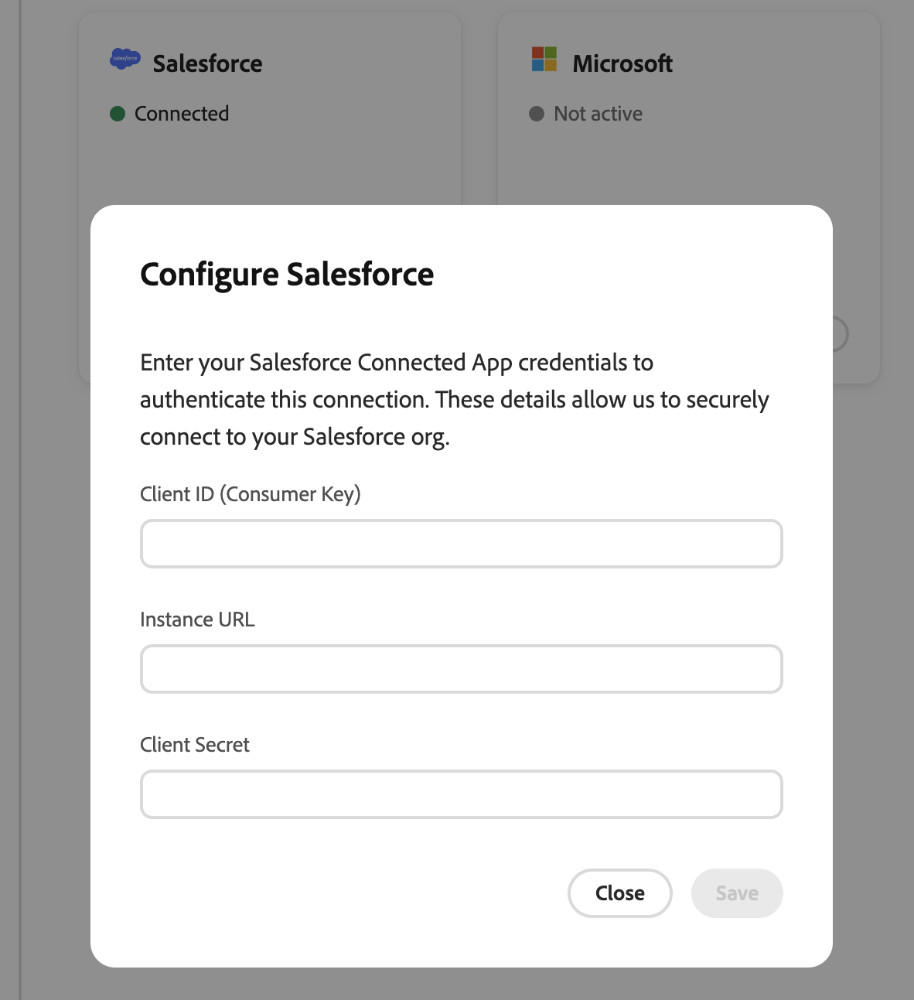

# Introdução ao Sales Qualifier

Depois que a Adobe provisionar o Sales Qualifier para sua organização, um administrador do sistema do [!DNL Marketo] deverá criar os grupos de usuários necessários e conectar o Salesforce ou o Microsoft Dynamics 365.

[Página inicial do Sales Qualifier](assets/homepage.png){width="800" zoomable="yes"}

## Configurar grupos de usuários

Os grupos de usuários no Adobe Admin Console são usados para controlar o acesso ao Sales Qualifier. Ambos os grupos devem ser criados antes que os usuários possam entrar.

Consulte a [documentação do Adobe Admin Console](https://helpx.adobe.com/business/enterprise/users/users-and-groups/user-groups.html) para obter informações sobre a configuração de grupos.

>[!PREREQUISITES]
>
>O administrador que cria os grupos deve atender a estes dois requisitos:
>
>* Seja um administrador de organização com acesso ao **[!UICONTROL Admin Console]** pelo alternador de aplicativos do Adobe.
>* Receba o produto Adobe Experience Platform ou seja um Administrador do sistema. Caso contrário, o Adobe Experience Platform não será exibido na lista de produtos.

### Usuários do Sales Qualifier

Os usuários devem pertencer ao grupo de usuários `Sales Qualifier` para acessar o aplicativo.

Essas etapas são executadas no Adobe Admin Console.

1. No alternador de aplicativos de nove pontos, selecione **[!UICONTROL Admin Console]**.
1. Selecione **[!UICONTROL Usuários]** > **[!UICONTROL Grupos de usuários]** > **[!UICONTROL Novo grupo de usuários]**.
1. Digite `Sales Qualifier` como o nome do grupo e selecione **[!UICONTROL Salvar]**.
1. Abra **[!UICONTROL Perfis de produto atribuídos]** e selecione **[!UICONTROL Atribuir perfil]**.
1. Selecione **[!UICONTROL Adobe Experience Platform]**.
1. Selecione o perfil de produto **[!UICONTROL Acesso integral à Produção Padrão]**, selecione **[!UICONTROL Aplicar]** e **[!UICONTROL Salvar]**.
1. Abra **[!UICONTROL Usuários]** e selecione **[!UICONTROL Adicionar usuários]** para adicionar todos os que precisam de acesso ao Sales Qualifier.

### Administradores do Sales Qualifier

Os administradores que configuram conexões do CRM, o [Centro de Conhecimento](admin-settings.md#knowledge-center) e as configurações de recusa de email global também devem pertencer ao grupo de usuários `Sales Qualifier Admins`.

1. No Adobe Admin Console, selecione **[!UICONTROL Usuários]** > **[!UICONTROL Grupos de usuários]** > **[!UICONTROL Novo grupo de usuários]**.
1. Digite `Sales Qualifier Admins` como o nome do grupo e selecione **[!UICONTROL Salvar]**.
1. Abra **[!UICONTROL Usuários]**, selecione **[!UICONTROL Adicionar usuários]** e adicione os administradores.
1. Confirme se cada administrador também é membro do grupo `Sales Qualifier`.

A associação em ambos os grupos torna as **[!UICONTROL Configurações de Administrador]** visíveis em **[!UICONTROL Administração]** na navegação à esquerda. Os usuários padrão trabalham com os campos, filtros e manuais que os administradores configuram. O rodapé de recusa configurado se aplica aos emails de saída automaticamente. Usuários padrão não podem alterar essas configurações.

Os nomes dos grupos de usuários devem corresponder exatamente como mostrado nas etapas anteriores.

Você também pode criar um grupo `Sales Qualifier BDR managers` opcional. Os membros deste grupo podem acessar relatórios de desempenho de email.

## Conectar seu CRM

O Sales Qualifier se conecta ao Salesforce ou Microsoft Dynamics 365 para fornecer aos BDRs uma visualização unificada de usuários, clientes potenciais, contatos, contas, oportunidades, mapeamentos de proprietários e atividades relacionadas. A conexão inicial requer acesso somente leitura a esses dados do CRM. Trabalhe com o administrador do CRM para preparar credenciais antes de conectar ao Sales Qualifier. Consulte [Integrações](integrations.md) para obter detalhes sobre a integração.

>[!PREREQUISITES]
>
>Para acessar a interface de administração do CRM, você deve pertencer aos grupos Adobe Admin Console `Sales Qualifier Admins` e `Sales Qualifier`.

>[!BEGINTABS]

>[!TAB Salesforce]

Um administrador do sistema do Salesforce cria um aplicativo cliente externo (também chamado de aplicativo conectado) e configura seu aplicativo executado como usuário.

>[!PREREQUISITES]
>
>Confirme se o administrador do Salesforce tem estas permissões:
>
>* Personalizar aplicativo
>* Exibir instalação e configuração
>* Modificar Todos os Dados
>* Gerenciar Aplicativos Conectados
>
>Sem _Gerenciar Aplicativos Conectados_, o administrador não pode exibir a ID do cliente e o segredo do cliente.

1. No Salesforce, vá para **[!UICONTROL Configuração]** > **[!UICONTROL Gerenciador de Aplicativos]** e selecione **[!UICONTROL Novo Aplicativo Conectado]** ou **[!UICONTROL Novo Aplicativo Cliente Externo]**.
1. Insira um nome de aplicativo e um email de contato administrativo.
1. Habilite o OAuth e insira um URL de retorno de chamada.

   Se a conexão não usar um redirecionamento, insira um URL válido.

1. Adicione os seguintes escopos OAuth:

   * Acessar o serviço de URL de identidade (`id`, `profile`, `email`, `address`, `phone`)
   * Gerenciar dados do usuário por meio de APIs (`api`)
   * Acessar identificadores de usuário exclusivos (`openid`)

1. Habilite o fluxo de credenciais do cliente e selecione um usuário **[!UICONTROL Executar como]**.
1. Confirme se o usuário executar como tem acesso de **Leitura** a `Leads`, `Accounts`, `Contacts`, `Tasks`, `Events`, `Opportunity`, `OpportunityContactRoles` e `OpportunityLineItems`. Confirme também se as **Atividades de acesso** estão habilitadas.
1. Salve o aplicativo.
1. No **[!UICONTROL App Manager]**, abra o aplicativo e selecione **[!UICONTROL Exibir]** > **[!UICONTROL Detalhes do Consumidor]**.
1. Copie os seguintes valores para a conexão do Sales Qualifier:

   * Chave do consumidor (ID do cliente)
   * Segredo do consumidor (Segredo do cliente)
   * URL de retorno de chamada
   * URL da instância do Salesforce

As etapas podem ser um pouco diferentes das descritas aqui. Consulte a [documentação do Salesforce](https://help.salesforce.com/s/) para obter mais informações.

### Encontrar o URL da instância do Salesforce

1. Entre e anote seu subdomínio da organização _Meu Domínio_ na barra de endereços do navegador (o valor `{{mydomain}}`).
1. Use o formato canônico para o Sales Qualifier: `https://{{mydomain}}.my.salesforce.com`.

Não use uma URL `lightning.force.com` como a URL da instância.

>[!TIP]
>
>Se a interface de conexões do CRM relatar a ausência de escopos, verifique o perfil do usuário executar como em **[!UICONTROL Permissões de Objeto Padrão]** para o acesso de **Leitura** a clientes potenciais, contatos, contas e oportunidades. Verifique também as **[!UICONTROL Configurações do objeto]** em cada conjunto de permissões atribuído.

>[!TAB Microsoft Dynamics 365]

Um administrador do Microsoft Dynamics 365 ou Azure registra um aplicativo e o adiciona ao ambiente do Dynamics.

1. Em Microsoft Entra ID, selecione **[!UICONTROL Registros de aplicativos]** e registre um aplicativo.
1. Copie a ID do cliente e a ID do locatário e crie um segredo do cliente.
1. No **[!UICONTROL Centro de administração do Power Platform]**, selecione **[!UICONTROL Ambientes]** e abra o ambiente do Dynamics.
1. Vá para **[!UICONTROL Configurações]** > **[!UICONTROL Usuários + permissões]** > **[!UICONTROL Usuários do aplicativo]** e selecione **[!UICONTROL Novo usuário do aplicativo]**.
1. Selecione o aplicativo Microsoft Entra registrado.
1. Atribua uma função de segurança que conceda acesso de leitura a clientes potenciais, contatos, contas, oportunidades e atividades.

   É necessária uma função de segurança. Sem um, o aplicativo não pode acessar os dados do Dynamics.

1. Colete a ID do cliente, o segredo do cliente, a ID do locatário e o URL da instância do Dynamics. Use o formulário de URL canônico `https://{{mydomain}}.crm.dynamics.com`.

>[!ENDTABS]

### Insira sua conexão

1. Como membro dos dois grupos obrigatórios do Sales Qualifier, faça logon no Sales Qualifier e confirme se a sandbox ou o ambiente correto está selecionado.
1. Na navegação à esquerda, expanda **[!UICONTROL Administração]** e selecione **[!UICONTROL Configurações de Administração]**.
1. Selecione **[!UICONTROL Conexões do CRM]** em **[!UICONTROL Integrações]**.

   A página exibe cartões para o Salesforce e o Microsoft Dynamics. Uma conexão inativa mostra **[!UICONTROL Conectar]**. Uma conexão configurada mostra **[!UICONTROL Conectado]** e **[!UICONTROL Gerenciar]**.

   {width="800" zoomable="yes"}

1. Selecione **[!UICONTROL Conectar]** para o CRM que você usa.
1. Insira as credenciais e a URL da instância do administrador do CRM.
1. Após uma conexão bem-sucedida, confirme se o cartão mostra **[!UICONTROL Conectado]**.

### Importar campos do CRM

Depois de conectar o CRM, configure o mapeamento de entrada para determinar quais campos do CRM aparecem no Sales Qualifier. No cartão do CRM conectado, selecione **[!UICONTROL Gerenciar]** para abrir o **[!UICONTROL Mapeamento de entrada]** e adicione uma seção para cada tipo de entidade cujos campos você deseja importar.

Consulte [Mapear campos do CRM (mapeamento de entrada)](integrations.md#map-crm-fields-inbound-mapping) para obter as etapas completas, incluindo como disponibilizar campos importados como filtros.

## Próximas etapas

>[!MORELIKETHIS]
>
>* [Clientes Potenciais](prospects.md)
>* [Fluxos de Trabalho de Saída](outbound-workflows.md)
