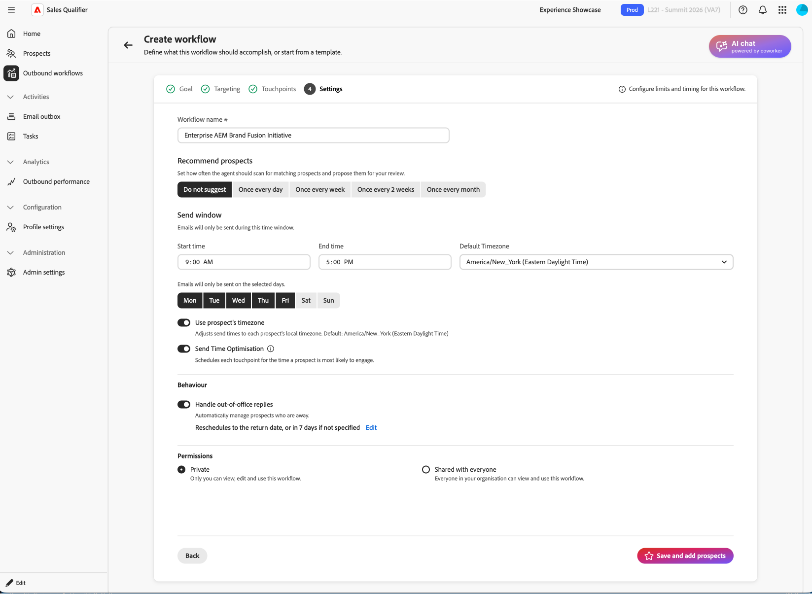

# Fluxos de trabalho de saída

Um fluxo de trabalho de saída é uma cadência de alcance orientada por metas. Você define a meta e os critérios de direcionamento. A IA propõe uma cadência multitoque e grava conteúdo de email personalizado para cada cliente potencial. Antes de ativar a cadência, revise e aprove cada email.

Um fluxo de trabalho de saída conecta quatro elementos:

* **Objetivo** — O resultado desejado do alcance externo, como reservar uma chamada de descoberta ou aumentar o registro de eventos.
* **Filtros de direcionamento** — Condições que determinam quais clientes potenciais estão qualificados.
* **Cadência do ponto de contato** — A sequência ordenada de email, chamada telefônica e etapas do LinkedIn InMail.
* **Conteúdo de email personalizado** — Conteúdo gerado por IA com base no perfil do cliente potencial, no contexto da conta, no histórico de participação e em notícias recentes.

A IA usa a meta para sugerir filtros de direcionamento, projetar a cadência, rascunhos de prompts de ponto de contato e personalizar cada email gerado.

## Principais conceitos

| Conceito | Descrição |
| --- | --- |
| **Fluxo de trabalho de saída** | Uma atividade de saída reutilizável definida por uma meta, filtros de direcionamento, cadência e configurações. |
| **Meta** | O que o alcance externo deve alcançar. |
| **Ponto de contato** | Uma etapa no ritmo (email, chamada telefônica ou LinkedIn InMail), agendada em relação à inscrição. |
| **Prompt do ponto de contato** | As instruções que a IA segue ao gerar uma linha de assunto e um corpo de email para um cliente potencial, incluindo tom, comprimento, foco e call to action. |
| **Cadência** | A sequência completa de pontos de contato: quantos, em que ordem e em que dias. |
| **Filtro de direcionamento** | Uma condição que limita o Fluxo de trabalho de saída a um subconjunto de prospetos. |
| **Rascunho** | Um email gerado que está pronto para revisão, mas ainda não foi aprovado. |
| **Raciocínio** | A explicação da IA sobre como ela escreveu determinado email, incluindo os sinais e as fontes de dados usadas. |
| **Inscrição** | Aprovar rascunhos de um cliente potencial, o que ativa a cadência e enfileira emails a serem enviados durante a janela de envio do Fluxo de Trabalho de Saída. |

As seções a seguir explicam como criar um fluxo de trabalho de saída, revisar emails gerados, aprovar prospetos e gerenciar fluxos de trabalho de saída.

## Criar um fluxo de trabalho de saída

O assistente de Fluxo de Trabalho de Saída tem cinco etapas: **[!UICONTROL Meta]**, **[!UICONTROL Direcionamento]**, **[!UICONTROL Gerar pontos de contato]**, **[!UICONTROL Configurações]** e **[!UICONTROL Adicionar prospetos]**. Sua meta molda as etapas restantes.

1. Na navegação à esquerda, selecione **[!UICONTROL Fluxos de trabalho de saída]**.
1. Na guia **[!UICONTROL Procurar]**, selecione **[!UICONTROL + Criar Fluxo de Trabalho de Saída]** no canto superior direito.

### Etapa 1: definir sua meta

A meta define o resultado pretendido e orienta o direcionamento, a cadência e a geração de email.

1. Selecione **[!UICONTROL Iniciar do zero]** para escrever sua própria meta ou selecione **[!UICONTROL Iniciar do modelo]** para usar um modelo salvo.

1. Selecione uma das **[!UICONTROL Metas recomendadas]** correspondentes à sua empresa. Cada recomendação inclui uma breve explicação do por que ela se encaixa. Selecione uma recomendação para preencher a meta, selecione **[!UICONTROL Exibir tudo]** para navegar pelo conjunto completo de recomendações ou insira sua própria meta. Você também pode escolher na lista **[!UICONTROL Metas populares]**.
1. Selecionar **[!UICONTROL Próximo: Direcionamento]**.

Declarar um resultado específico na meta. Por exemplo, digite `Book a 15-minute discovery call with marketing leaders evaluating campaign automation` em vez de `Promote campaign automation`.

### Etapa 2: configurar filtros de direcionamento

Os filtros de direcionamento definem quais clientes potenciais são qualificados. Ao adicionar prospetos posteriormente, somente os prospetos que correspondem a esses filtros são exibidos na lista de seleção.

{width="800" zoomable="yes"}

1. Selecione a seta para baixo para abrir a lista **[!UICONTROL Adicionar um filtro]** e selecione um filtro.

1. Defina valores para o filtro.
1. Adicione mais filtros se precisar restringir o público.

1. Selecionar **[!UICONTROL Próximo: Gerar pontos de contato]**.

### Etapa 3: gerar e revisar pontos de contato

Após configurar o direcionamento, a IA analisa a meta e os critérios de direcionamento, define a cadência e grava um prompt para cada ponto de contato. A cadência pode incluir email, chamada telefônica e etapas do LinkedIn In InMail.

{width="800" zoomable="yes"}

Expanda um ponto de contato de email para ler seu prompt. O prompt orienta a IA durante a gravação do email de cada cliente potencial, incluindo o tom, a duração, o foco e o call to action.

Digitar uma barra `/` exibe a lista de tokens definidos que você pode usar para personalizar o email.

#### Regenerar a cadência

Se a cadência não for o que você deseja, selecione **[!UICONTROL Regenerar]** e insira uma instrução de refinamento. Por exemplo:

* `Use three touchpoints across two weeks`
* `Lead with an executive briefing offer in the first email`
* `Add a nurture touch focused on a relevant case study`

A IA reescreve a cadência completa com base em suas instruções. Para ajustar um ponto de contato de email, edite o prompt em vez de regenerar toda a cadência.

Defina um atraso do ponto de contato em dias, horas e minutos. Defina os dias, horas e minutos como `0` para enviar o ponto de contato sem espera após a inscrição ou a conclusão do ponto de contato anterior. Use um atraso maior para espaçar pontos de contato posteriores na cadência.

#### Usar o Centro de conhecimento em prompts

Se sua organização criou um manual do [Centro de Conhecimento](admin-settings.md#knowledge-center), consulte-o no prompt. Nomeie o documento e descreva o contexto a ser usado. Por exemplo, digite `Use the ABC positioning guide from the Knowledge Center and focus on the security value proposition`.

Quando a cadência e os prompts estiverem prontos, selecione **[!UICONTROL Próximo: Configurações]**.

Refine os prompts de ponto de contato antes de gerar emails de prospecto. A IA usa essas solicitações para cada cliente potencial selecionado.

### Etapa 4: definir configurações de Fluxo de trabalho de saída

A etapa **[!UICONTROL Configurações]** controla como o Fluxo de Trabalho de Saída é executado.

{width="800" zoomable="yes"}

1. Revise o **[!UICONTROL nome do Fluxo de Trabalho de Saída]** e altere-o se necessário.
1. Em **[!UICONTROL Máximo de prospetos por Fluxo de Trabalho de Saída]**, confirme o número máximo de prospetos que o Fluxo de Trabalho de Saída pode gerenciar ao mesmo tempo.
1. Defina a **[!UICONTROL Janela de envio]** para as horas em que os emails de saída podem ser enviados.
1. Selecione os dias da semana em que os emails podem ser enviados. Para evitar envios no fim de semana, selecione apenas os dias da semana em vez de usar uma configuração **[!UICONTROL Ignorar fins de semana]** separada.
1. Escolha se deseja enviar durante as horas mais ativas de cada cliente potencial.
1. Para interromper pontos de contato de acompanhamento automaticamente depois que um cliente potencial marcar uma reunião, ative a **[!UICONTROL Pausa da Reserva de Reunião]**.
1. Escolha se deseja usar o fuso horário de cada cliente potencial ou o **[!UICONTROL Fuso Horário]** do Fluxo de Trabalho de Saída para o tempo de envio. Se você usar o fuso horário do Fluxo de trabalho de saída, confirme se ele corresponde ao seu público-alvo.
1. Em **[!UICONTROL Permissões]**, mantenha **[!UICONTROL Privado]** (o padrão) ou selecione **[!UICONTROL Compartilhado com todos]**. Para obter detalhes, consulte [Compartilhar um Fluxo de Trabalho de Saída](#share-an-outbound-workflow).
1. Selecione **[!UICONTROL Salvar e adicionar clientes potenciais]**.

O rodapé de opção de não participação é configurado globalmente por um administrador e se aplica a emails de saída, independentemente das configurações do Fluxo de trabalho de saída. Consulte [Configurar recusa de email global](integrations.md#configure-global-email-opt-out).

### Etapa 5: adicionar prospetos e iniciar a geração de email

Salvar abre a visualização de seleção de cliente potencial com os filtros de direcionamento da etapa 2 aplicados.

1. Revise a lista.

   As linhas geralmente incluem nome do cliente potencial, conta, email, cargo, status do engajamento e status do cliente potencial.

1. Ajuste os filtros aqui se precisar expandir ou restringir a lista.
1. Selecione prospetos usando as caixas de seleção.
1. Selecione **[!UICONTROL Avançar: revise os pontos de contato]** para iniciar a geração de email por cliente potencial.

A IA gera um email personalizado para cada cliente potencial selecionado e ponto de contato de email. Os pontos de contato de telefone e do LinkedIn In InMail permanecem como etapas programadas. Para continuar trabalhando durante a geração, selecione **[!UICONTROL Notificar quando estiver pronto]**.

Para cada prospecto, a IA combina o prompt do ponto de contato com dados de pessoa e conta, histórico de engajamento e notícias recentes para produzir uma linha de assunto e um corpo.

## Revisar e refinar emails gerados

Quando a geração termina, a exibição detalhada do Fluxo de trabalho de saída solicita que você revise os rascunhos. A Sales Qualifier não envia emails até que você o aprove.

1. Na exibição detalhada do Fluxo de Trabalho de Saída, selecione **[!UICONTROL Revisar rascunhos]** no banner.
1. A etapa **[!UICONTROL Pontos de contato de revisão]** tem duas guias:
   * **[!UICONTROL Pronto para Revisão]**—Emails que terminaram de ser gerados.
   * **[!UICONTROL Gerando]**—Emails que ainda estão sendo gravados.
1. Na lista de clientes potenciais à esquerda, selecione um nome para carregar os pontos de contato do cliente potencial à direita.
1. Use a divisa (**>**) em um ponto de contato para expandir e ler toda a linha de assunto e o corpo.

### Leia o raciocínio sobre IA

Para cada email gerado, o **[!UICONTROL Raciocínio]** explica como a IA criou essa mensagem, incluindo sinais, atributos e fontes que moldaram o conteúdo e o call to action. Revise essas informações e valide a personalização antes de aprovar.

### Editar emails diretamente

Para pequenas alterações de texto ou tom:

1. No ponto de contato expandido, selecione o ícone **[!UICONTROL Editar]** para abrir o editor.
1. Edite a linha de assunto ou o corpo.
1. Selecione **[!UICONTROL Salvar]**.

### Refinar emails com IA

Para alterações estruturais ou de ênfase, use **[!UICONTROL Gerar com IA]**. A IA reescreve o email, mantendo seu contexto de personalização.

1. No editor de email, selecione **[!UICONTROL Gerar com IA]**.

1. Digite uma instrução de limpeza, por exemplo:
   * `Make it shorter and more direct. Keep it under 100 words.`
   * `Focus more on the prospect's role and how the solution helps them specifically.`
   * `Change the call-to-action to suggest a 15-minute introductory call instead.`
1. Revise a revisão e edite-a se necessário.
1. Selecione **[!UICONTROL Salvar]**.

>[!TIP]
>
>Use edições diretas para alterações de texto e tom. Use **[!UICONTROL Gerar com IA]** para reescrever o email.

## Aprovar e inscrever clientes potenciais

A aprovação ativa a cadência de um cliente potencial. O sistema não envia emails para um cliente potencial até que você os aprove e inscreva.

1. Na lista de prospetos à esquerda, selecione os prospetos cujos emails você analisou e estão prontos para envio.
1. Selecione **[!UICONTROL Aprovar e inscrever clientes potenciais]** no canto inferior direito.

Os emails aprovados são enviados de acordo com os dias selecionados, a janela de envio, a opção de horas ativas e a configuração de fuso horário do Fluxo de trabalho de saída. Um ponto de contato com atraso zero envia sem espera; cada ponto de contato segue seu atraso configurado. Os clientes potenciais não aprovados permanecem em **[!UICONTROL Pronto para Revisão]**.

## Compartilhar um fluxo de trabalho de saída

Cada Fluxo de Trabalho de Saída tem uma configuração **[!UICONTROL Permissões]**. Os fluxos de trabalho de saída são **[!UICONTROL privados]** por padrão. O proprietário pode selecionar **[!UICONTROL Compartilhado com todos]** para disponibilizar um Fluxo de Trabalho de Saída para a equipe.

>[!CAUTION]
>
>O compartilhamento é permanente. Depois que um Fluxo de Trabalho de Saída é definido como **[!UICONTROL Compartilhado com todos]**, ele não pode ser alterado novamente para **[!UICONTROL Particular]**.

Em um Fluxo de trabalho de saída compartilhado, os colegas de equipe podem inscrever seus próprios prospetos. Cada pessoa pode gerenciar ou pausar somente os clientes potenciais aos quais se inscreveu, inclusive ao usar ações em massa. Somente o proprietário do Fluxo de trabalho de saída pode editar configurações no nível do plano, incluindo a programação, o fuso horário, a cadência e outras configurações. Essas configurações são somente leitura para colegas de equipe.

Use esses filtros para manter o foco dos fluxos de trabalho de saída e resultados compartilhados:

* Em **[!UICONTROL Clientes Potenciais Envolvidos]** e **[!UICONTROL Desempenho]**, use **[!UICONTROL Inscrito por]** para filtrar clientes potenciais pela pessoa que os inscreveu. O filtro assume como padrão os clientes potenciais aos quais você se inscreveu.
* Na guia **[!UICONTROL Procurar]**, use o filtro de compartilhamento para selecionar **[!UICONTROL Compartilhado(s) por mim]**, **[!UICONTROL Compartilhado(s) comigo]**, **[!UICONTROL Particular]** ou **[!UICONTROL Todos]**.

## Tratamento de respostas fora do escritório

Quando um cliente potencial responde com uma mensagem de ausência temporária, o Fluxo de trabalho de saída trata dele automaticamente.

* **Retomada automática**: ativada por padrão. Se a resposta de ausência temporária incluir uma data de retorno, o Fluxo de trabalho de saída retomará a cadência nessa data. Se nenhuma data de retorno for fornecida, o Fluxo de trabalho de saída será retomado depois de um buffer que sua equipe pode configurar.
* **Opções manuais**: um representante ainda pode selecionar **[!UICONTROL Retomar agora]** ou agendar uma data específica de retomada. Consulte [Gerenciar fluxos de trabalho de saída existentes](#manage-existing-outbound-workflows).

## Gerenciar fluxos de trabalho de saída existentes

Na página **[!UICONTROL Fluxos de Trabalho de Saída]**, a guia **[!UICONTROL Procurar]** lista todos os Fluxos de Trabalho de Saída disponíveis para você. Cada cartão mostra a meta, os pontos de contato configurados e as métricas de desempenho. Use esta exibição para monitorar fluxos de trabalho de saída, revisar rascunhos ou adicionar prospetos.

## Caixa de saída de email

A [Caixa de Saída de Email](email-outbox.md) lista os emails automatizados enviados em seu nome e todas as respostas.

## Reserva de reunião

Ao conectar o calendário, o Sales Qualifier gera um link de reserva pessoal que os clientes potenciais podem usar para agendar horas com você.

* **Links de reserva**—Configure a conexão e a disponibilidade do calendário nas [Configurações de perfil](profile-settings.md). Adicione o link de reserva à sua assinatura de email para que ele apareça em emails de saída.
* **Posicionamento de cadência** — o Sales Qualifier insere seu link de reserva em pontos relevantes em uma cadência. Você pode alterar sua disposição.
* **Pausa de Reserva** — Quando um cliente potencial registra uma reunião, a **[!UICONTROL Pausa de Reserva de Reunião]** interrompe as acompanhamentos adicionais. Consulte [Etapa 4: definir configurações de Fluxo de Trabalho de Saída](#step-4-configure-outbound-workflow-settings).

Acompanhe os resultados da reserva na página [Desempenho de saída](performance.md).

## Práticas recomendadas para fluxos de trabalho de saída

* **Definir uma meta específica.** Direcionamento, cadência e emails são derivados da meta. Indique o resultado que deseja que o workflow de saída alcance.
* **Finalizar prompts de ponto de contato antes de gerar por prospecto.** Após a geração em massa, as alterações normalmente são feitas em um cliente potencial de cada vez.
* **Usar o raciocínio como uma verificação de qualidade.** Se o sinal errado for enfatizado ou um sinal relevante estiver ausente, edite o email ou revise o prompt do ponto de contato e gere novamente a cadência.
* **Corresponder a ferramenta de edição à alteração.** Use edições diretas para texto e tom. Use **[!UICONTROL Gerar com IA]** para reestruturação ou redefinição.
* **Aprove somente o que você revisou.** Expanda os pontos de contato, leia o conteúdo e refine quando necessário antes da inscrição.

>[!MORELIKETHIS]
>
>* [Tarefas](tasks.md)
>* [Centro de conhecimento](admin-settings.md#knowledge-center)
>* [Desempenho de saída](performance.md)
