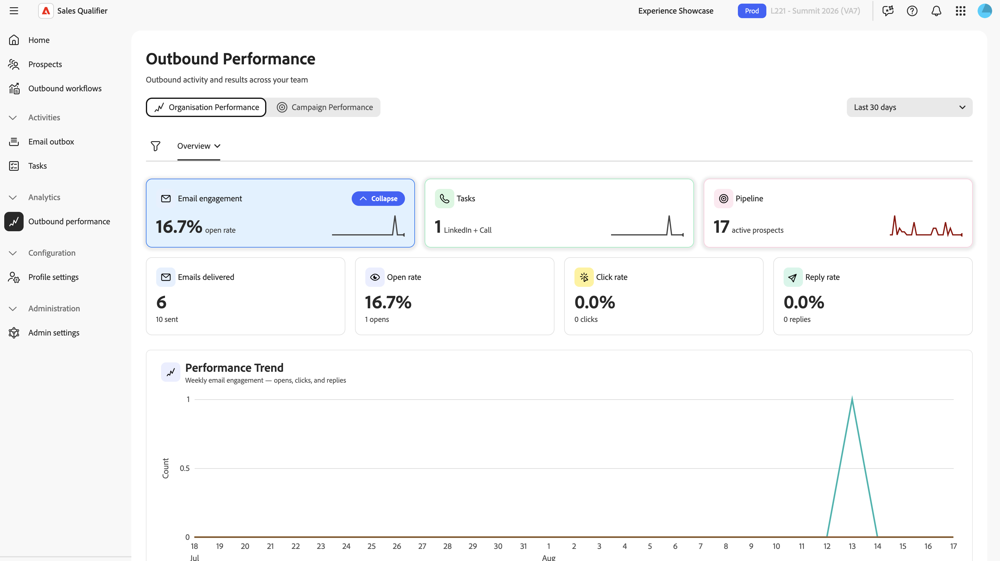

# Desempenho de saída no Sales Qualifier

Na navegação à esquerda, selecione **[!UICONTROL Desempenho de saída]** para rastrear a atividade de saída e os resultados em sua equipe. O painel tem duas exibições: **[!UICONTROL Desempenho da Organização]** e **[!UICONTROL Desempenho da Campanha]**.

{width="800" zoomable="yes"}

## Filtro e período de tempo

Esses controles se aplicam a exibições e a todas as guias:

* **[!UICONTROL Filtros]**: selecione **[!UICONTROL Filtros]** para restringir o painel por membro da equipe e campanha.
* **[!UICONTROL Período]**: selecione uma janela de relatórios de 7, 15, 30, 60, 90, 180 ou 365 dias.

## Desempenho da organização

O **[!UICONTROL Desempenho da Organização]** gera relatórios sobre a atividade de saída e os resultados na equipe. Ela tem três guias: **[!UICONTROL Visão geral]**, **[!UICONTROL Emails]** e **[!UICONTROL Tarefas]**.

### Guia Visão geral

A guia **[!UICONTROL Visão geral]** resume os resultados de saída. Clique em qualquer uma das caixas para exibir o gráfico com essas informações.

* **Blocos**: pipeline, envolvimento de email e atividade manual, cada um com uma alteração de tendência em relação ao período anterior.
* **Gráfico de tendência de desempenho**: desempenho de saída durante o período selecionado.
* Tabela de **[!UICONTROL Atividade da Equipe]**: atividade categorizada por representante.
* **Total de clientes potenciais**: o número total de clientes potenciais, não apenas os ativos, portanto, o volume de saída total não é subcontado.

### Guia Emails

A guia **[!UICONTROL Emails]** informa sobre o volume e a eficácia do email:

* **Blocos**: a taxa de abertura e a taxa de cliques, mostradas por padrão para que o desempenho seja comparável em campanhas de volume diferente. Selecione o botão para exibir contagens brutas de emails enviados, abertos, clicados e respondidos.
* **Gráfico de tendências de emails semanais**: atividade de email por semana.
* Tabela de desempenho de email por representante.

A Sales Qualifier atribui status separados a respostas e rejeições fora do escritório para que você possa diferenciá-las do envolvimento do cliente potencial.

### Guia Tarefas

A guia **[!UICONTROL Tarefas]** informa sobre alcance manual:

* **Blocos**: conclusão de chamadas telefônicas e mensagens do LinkedIn, incluindo a taxa de conclusão.
* **Gráfico de tendências da tarefa**: conclusão da tarefa durante o período selecionado.
* Tabela de tarefas por representante.

## Desempenho da campanha

**[!UICONTROL Desempenho da campanha]** relata os resultados de saída por campanha de Fluxo de Trabalho de Saída:

* **Blocos de KPI**: clientes potenciais ativos, taxa de abertura, taxa de cliques, taxa de resposta e reuniões reservadas. O sistema mostra a taxa de abertura e de cliques por padrão para que o desempenho seja comparável em campanhas de volume diferente. Selecione a alternância para exibir contagens brutas.
* **Gráfico de tendências de métricas de campanha**: KPIs de campanha durante o período selecionado.
* Tabela **[!UICONTROL Campanhas]**: email, reunião, chamada e atividade de mensagem do LinkedIn para cada campanha. Para visualizar os detalhes de nível representativo de uma campanha, expanda sua linha.

Consulte [Reserva da reunião](outbound-workflows.md#meeting-booking) para saber como as reservas são geradas.

>[!MORELIKETHIS]
>
>* [Fluxos de Trabalho de Saída](outbound-workflows.md)
>* [Tarefas](tasks.md)
