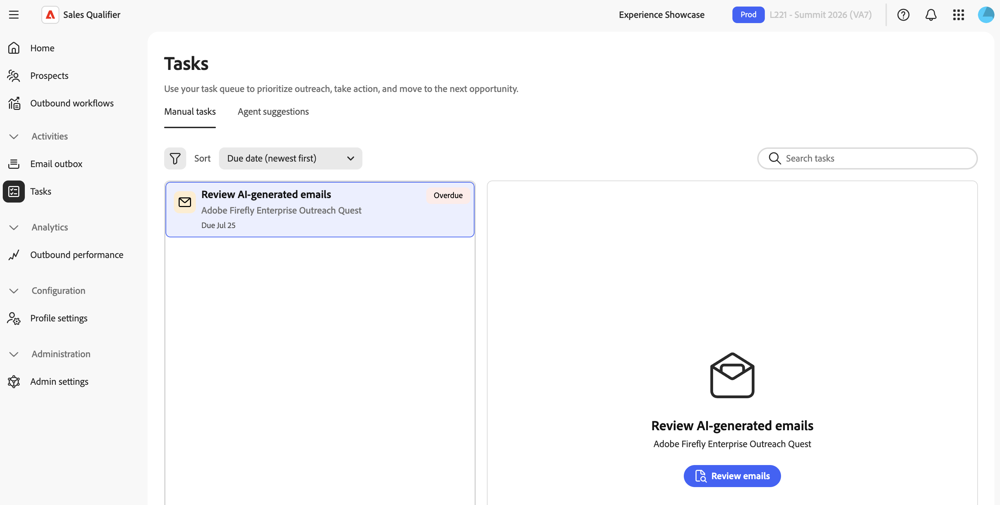
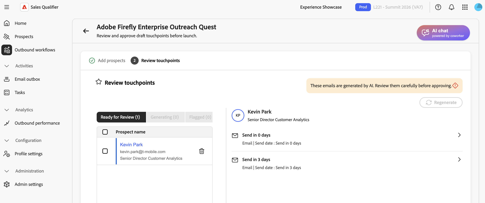

# Tarefas

Use **[!UICONTROL Tarefas]** para concluir as ações geradas por Fluxos de Trabalho de Saída. Selecione uma tarefa, execute uma ação, marque a tarefa como concluída e continue para a próxima tarefa sem sair da página.

Na navegação à esquerda, vá para **[!UICONTROL Atividades]** > **[!UICONTROL Tarefas]**.

## Exibições de tarefa

A página tem duas guias:

* **[!UICONTROL Tarefas manuais]**—Telefonemas, LinkedIn InMails e revisões de email para clientes potenciais inscritos em um Fluxo de Trabalho de Saída.
* **[!UICONTROL Sugestões de agente]** — Clientes potenciais que correspondem a um critério de direcionamento do Fluxo de Trabalho de Saída e são recomendados para inscrição.

Cada guia tem seus próprios filtros, opções de classificação e layout de dois painéis. A lista de tarefas aparece à esquerda e o painel de trabalho aparece à direita. Selecionar uma tarefa carrega seus detalhes no painel de trabalho. Quando você conclui uma tarefa, a próxima tarefa é selecionada automaticamente.

## Tarefas manuais

### Tipos de tarefa

As tarefas manuais estão vinculadas às etapas do Fluxo de trabalho de saída e têm três tipos:

* **[!UICONTROL Telefonema]** — Criado quando uma cadência atinge uma etapa de telefonema. O painel de trabalho mostra o número de telefone do cliente potencial e, quando disponível, um script de chamada gerado por IA.

* **[!UICONTROL LinkedIn InMail]** — Criado quando uma cadência atinge uma etapa do LinkedIn InMail. O painel de trabalho mostra o conteúdo a ser copiado e enviado do LinkedIn. Expanda **[!UICONTROL Razão da IA]** para analisar a razão.

* **[!UICONTROL Revisão de email]**—Criada após o Sales Qualifier gerar emails personalizados de um cliente potencial. Selecione **[!UICONTROL Revisar emails]** para revisar e aprovar os rascunhos antes de o alcance externo começar. Consulte [Revisar e refinar emails gerados](outbound-workflows.md#review-and-refine-generated-emails).

### O painel de trabalho

Para uma tarefa **[!UICONTROL Telefonema]** ou **[!UICONTROL LinkedIn InMail]**, o painel de trabalho contém:

* **[!UICONTROL Prospecto]** — O nome, o link de email e o número de telefone do cliente potencial, quando aplicável.
* **[!UICONTROL Fluxo de Trabalho de Saída]** — O nome do Fluxo de Trabalho de Saída vinculado, a data de vencimento e o indicador de salto automático, quando aplicável.
* **Conteúdo da tarefa** — O script de chamada ou o conteúdo do InMail.
* **[!UICONTROL Notas]** — As notas são salvas automaticamente quando outra tarefa é selecionada. Não é possível editar notas depois que uma tarefa é concluída, ignorada ou cancelada.

### Gerar um script de chamada

Para uma tarefa **[!UICONTROL Telefonema]**, selecione **[!UICONTROL Gerar script de chamada]**. Quando a geração terminar, selecione **[!UICONTROL Exibir Script de Chamada Detalhada]**. Se a geração falhar, tente novamente no painel.

### Ações da tarefa

Duas ações estão disponíveis no cabeçalho do painel de trabalho:

* **[!UICONTROL Marcar como concluído]**—Use esta ação depois de fazer a chamada, enviar o InMail ou revisar os emails. A fila avança para a próxima tarefa.
* **[!UICONTROL Ignorar]** — Use esta ação quando não puder concluir a etapa, mas quiser manter o cliente potencial no Fluxo de Trabalho de Saída. O cliente potencial avança para a próxima etapa de cadência.

As tarefas de Telefonema e InMail do LinkedIn podem ser ignoradas automaticamente se permanecerem abertas além do limite configurado. Um salto automático avança o cliente potencial pela cadência e não afeta os pontos de contato de email agendados.

### Filtrar, pesquisar e classificar

A barra de ferramentas acima da lista controla quais tarefas são exibidas e em que ordem. Suas opções de filtro e classificação são salvas e reaplicadas na próxima vez que você abrir a página.

* **[!UICONTROL Filtro]**—Abra o painel de filtro:
  * **[!UICONTROL Status]**—**[!UICONTROL Atual]**, **[!UICONTROL Futuro]**, **[!UICONTROL Vencido]**, **[!UICONTROL Concluído]**, **[!UICONTROL Cancelado]**, **[!UICONTROL Ignorado]**.
  * **[!UICONTROL Tipo de tarefa]**—**[!UICONTROL Email Review]**, **[!UICONTROL LinkedIn InMail]**, **[!UICONTROL Telefonema]**.
  * **[!UICONTROL Data de vencimento]**.
  * **[!UICONTROL Fluxo de Trabalho de Saída]** — Uma lista pesquisável de seus Fluxos de Trabalho de Saída.
* **[!UICONTROL Classificar]** — Classificar por data de vencimento ou data de criação. A ordem de classificação também determina a ordem em que a fila avança.
* **[!UICONTROL Pesquisar tarefas]** — Localize tarefas por nome de cliente potencial, nome de empresa ou Fluxo de Trabalho de Saída. A pesquisa se aplica com filtros ativos.

Filtros ativos aparecem como chips abaixo da barra de ferramentas. Selecione **[!UICONTROL Limpar tudo]** para redefini-los.

### Status da tarefa

Cada tarefa mostra seu status atual:

| Status | Descrição |
| --- | --- |
| **[!UICONTROL Atual]** | Com prazo e pronto para agir. As tarefas atuais não mostram nenhuma medalha. |
| **[!UICONTROL Próximos]** | A etapa anterior está concluída, mas a data de vencimento está no futuro. Você pode agir cedo se o momento estiver certo. |
| **[!UICONTROL Vencido]** | Ultrapassou a data de vencimento e ainda não foi concluído. A tarefa está sinalizada para atenção. |
| **[!UICONTROL Concluído]** | Você concluiu a ação e marcou a tarefa como concluída. |
| **[!UICONTROL Ignorado]** | Você ignorou a etapa ou ela ignorou automaticamente. O cliente potencial avança no Fluxo de trabalho de saída. |
| **[!UICONTROL Cancelado]** | O sistema cancelou a tarefa devido a uma alteração no Fluxo de trabalho de saída. |

As tarefas concluídas, ignoradas e canceladas são finais. Suas ações não estão mais disponíveis e suas notas são somente leitura.

## Sugestões do agente

A guia **[!UICONTROL Sugestões do agente]** lista os clientes potenciais que correspondem aos critérios de direcionamento de um Fluxo de Trabalho de Saída e são recomendados para inscrição. Para ativar as recomendações, consulte [Fluxos de Trabalho de Saída](outbound-workflows.md).

Selecione uma sugestão para revisá-la no painel de trabalho:

* Um selo de recenticidade marca cada sugestão como **[!UICONTROL Nova]** ou **[!UICONTROL Anterior]**.
* A tabela **[!UICONTROL Clientes potenciais recomendados]** ou **[!UICONTROL Contatos recomendados]** lista os clientes potenciais propostos com colunas para **[!UICONTROL Nome]**, **[!UICONTROL Título]**, **[!UICONTROL Conta]**, **[!UICONTROL Status]**, **[!UICONTROL Email]** e **[!UICONTROL Última atualização]**.

Duas ações estão disponíveis:

* **[!UICONTROL Revisar prospetos]**—Abra o Fluxo de Trabalho de Saída para revisar e inscrever prospetos recomendados. Consulte [Adicionar clientes potenciais e iniciar geração de email](outbound-workflows.md#step-5-add-prospects-and-start-email-generation).
* **[!UICONTROL Marcar como concluída]**—Descarte a sugestão depois de revisá-la.

A guia **[!UICONTROL Sugestões do agente]** inclui os filtros de status **[!UICONTROL Atual]**, **[!UICONTROL Concluído]** e **[!UICONTROL Cancelado]**, um filtro de Fluxo de Trabalho de Saída e a classificação por data de criação.

## Concluir tarefas de um fluxo de trabalho de saída

Na exibição **[!UICONTROL Clientes Potenciais Envolvidos]** de um Fluxo de Trabalho de Saída, um ponto de contato manual fornece as mesmas opções de **[!UICONTROL Marcar como concluído]**, **[!UICONTROL Ignorar]** e anotações. Concluir uma tarefa lá também atualiza seu status na página **[!UICONTROL Tarefas]**. Consulte [Fluxos de Trabalho de Saída](outbound-workflows.md).

## Estados vazios

* Quando você não tem nenhuma tarefa para desempenhar, a lista mostra uma mensagem de _Você está no auge hoje_.
* Quando os filtros não correspondem a nenhuma tarefa, a lista relata que nenhuma tarefa corresponde aos seus filtros.
* Quando nenhuma tarefa é selecionada, o painel de trabalho solicita que você selecione uma tarefa para visualizar seus detalhes.

>[!MORELIKETHIS]
>
>* [Fluxos de Trabalho de Saída](outbound-workflows.md)
>* [Desempenho de saída](performance.md)
>* [Clientes Potenciais](prospects.md)
